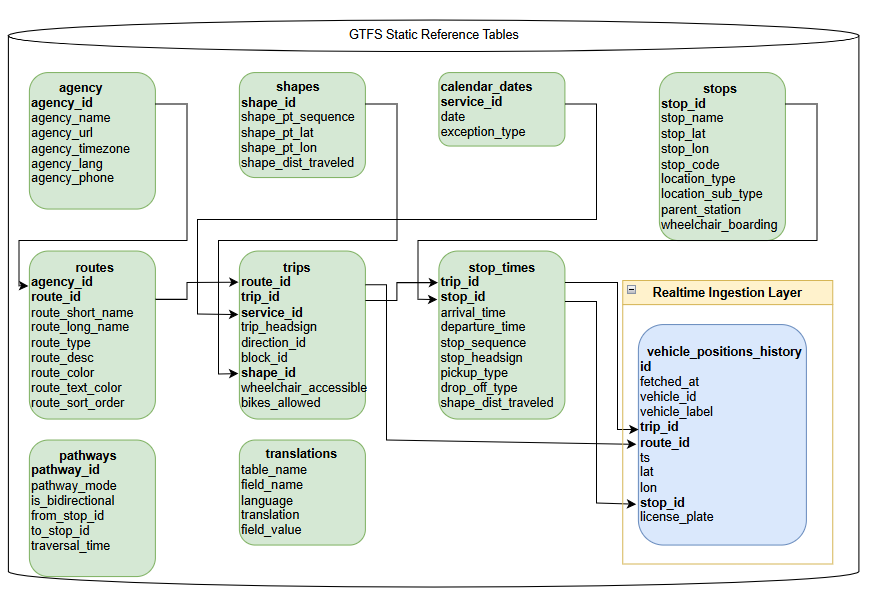

# 🚍 BKK Realtime Data Pipeline (GCP + PostgreSQL)

A production-style data ingestion pipeline that collects realtime public transport data and static GTFS feeds using Python, Bash and Google Cloud.

---

## 🧱 System Architecture

BKK API → Python ingestion → GCP Compute Engine (cron jobs) → Cloud SQL PostgreSQL

Key components:

- Realtime vehicle ingestion (minutely)
- Static GTFS refresh (daily)
- GitHub auto-deployment via git auto pull
- Lock-safe cron execution

## 🗄 Database ER Diagram

---

## ⚙️ Tech Stack

- Python
- Bash
- PostgreSQL (Cloud SQL)
- Google Cloud Compute Engine
- Cron scheduling
- GitHub

---

## 🔄 Data Pipelines

### 1️⃣ Realtime Vehicle Pipeline

Runs every minute.

Steps:

1. Activate Python virtual environment
2. Load environment variables from `.env`
3. Fetch GTFS-RT vehicle positions
4. Insert into PostgreSQL

Safety features:

- `flock` locking
- `set -euo pipefail`
- structured logging

---

### 2️⃣ Static GTFS Pipeline

Runs daily at 03:00.

Processes:

- stops
- routes
- trips
- shapes

---

### 3️⃣ Git Auto Deployment

Hourly cron job that pulls latest commits from GitHub.

Prevents:

- merge conflicts
- duplicate runs

---

## 🧠 Design Decisions

Why Compute Engine instead of Cloud Run?

- Persistent scheduling
- Simple cron-based orchestration
- Easier debugging during development

Why Bash entrypoints?

- Clear separation of environment and logic
- Production-like workflow

---

## 🛠 Challenges & Solutions

- Cron used /bin/sh instead of bash → fixed by explicit /bin/bash
- Concurrent cron runs → solved with flock locking
- Cloud SQL connectivity → static external IP + allowlist
